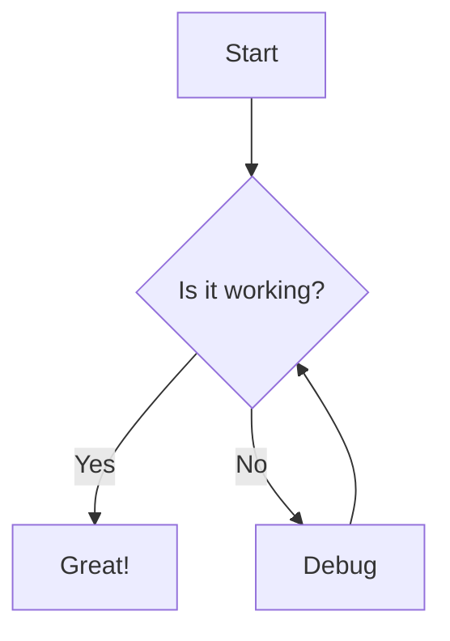
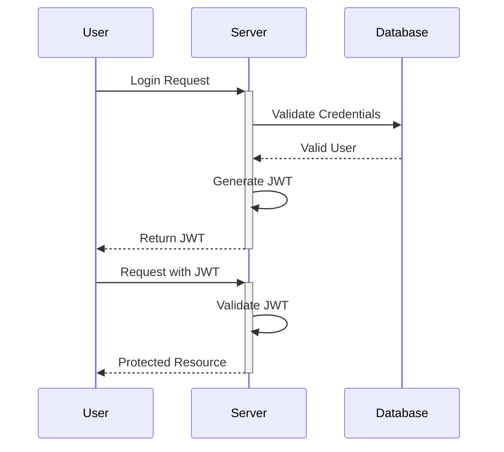
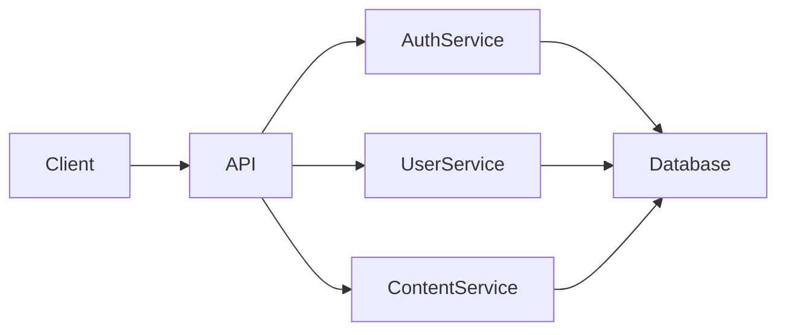

# Why Use Mermaid for Diagrams: Benefits for Developers and Technical Teams

In the world of software development, clear communication of complex systems is crucial. Traditional diagramming tools often create friction in development workflows—they're separate from your code, require special software, and create binary files that don't work well with version control. [Mermaid](https://mermaid.js.org/) offers a compelling alternative by allowing you to create diagrams using a simple text-based syntax. In this article, we'll explore why Mermaid has become an essential tool for modern development teams.

**Creating and maintaining technical diagrams shouldn't be a separate, cumbersome process from your development workflow.** Mermaid addresses this challenge by integrating diagrams directly into your codebase and documentation. Let's explore the key benefits that make Mermaid worth adopting for your team.

---

## 1. Version Control Integration

### Benefits
Mermaid diagrams are defined as text, making them perfect for version control systems like Git. This brings several advantages:

- **Change tracking**: See exactly what changed in a diagram and who changed it
- **Branching and merging**: Diagrams can follow the same branch/merge workflow as code
- **Code review**: Review diagram changes alongside code changes
- **History**: Maintain a complete history of how your diagrams evolved

### Example


This flowchart can be committed to Git, tracked through changes, and merged just like code.

## 2. AI-Friendly Format

### Benefits
As a text-based format, Mermaid is incredibly AI-friendly:

- **Generation**: AI tools like ChatGPT and Claude can generate Mermaid diagrams directly
- **Modification**: Ask AI to modify an existing diagram by changing the text
- **Understanding**: AI can "read" and understand Mermaid diagrams by parsing the syntax
- **Integration**: Easily integrate diagram generation into AI-powered documentation tools

### Example
You can ask an AI assistant: "Create a sequence diagram showing user authentication flow with JWT" and get working Mermaid code like:



## 3. Documentation Integration

### Benefits
Mermaid diagrams can be embedded directly in Markdown documentation:

- **Single source of truth**: Keep diagrams with the documentation they support
- **Markdown compatibility**: Works in GitHub, GitLab, Notion, and most documentation tools
- **Automatic rendering**: Many platforms render Mermaid automatically
- **Contextual placement**: Place diagrams exactly where they're needed in explanations

### Example
In a GitHub README.md:

```markdown
## System Architecture

Our application follows a microservice architecture pattern:



## 4. Maintainability

### Benefits
Text-based diagrams are inherently more maintainable:

- **Simple updates**: Change a few lines of text rather than reopening a diagram editor
- **Find and replace**: Use text tools to make systematic changes across multiple diagrams
- **Reusable components**: Define common elements and reuse them across diagrams
- **Automated updates**: Scripts can update diagrams based on code changes

### Example
Updating a component name across multiple diagrams:

```bash
# Update all diagrams to rename "UserService" to "IdentityService"
find . -name "*.md" -exec sed -i 's/UserService/IdentityService/g' {} \;
```

## 5. Cross-Platform Compatibility

### Benefits
Being text-based makes Mermaid incredibly portable:

- **No special software**: No need for specific diagramming tools
- **Platform independence**: Works anywhere Markdown or HTML works
- **Offline capability**: Create and edit diagrams without internet access
- **Responsive rendering**: Diagrams render appropriately for different screen sizes

### Example
The same Mermaid diagram works in:
- GitHub/GitLab repositories
- Static site generators (Hugo, Jekyll, etc.)
- Documentation platforms (ReadTheDocs, Docusaurus)
- Note-taking apps (Obsidian, Notion)
- Presentation tools (Marp, Slidev)

## 6. Integration with Development Workflows

### Benefits
Mermaid fits seamlessly into modern development workflows:

- **CI/CD friendly**: Validate diagrams as part of your CI pipeline
- **Automated generation**: Generate diagrams from code or infrastructure
- **Living documentation**: Diagrams can update automatically as systems change
- **Review alongside code**: Review diagram changes in the same PR as code changes

### Example
An Azure DevOps pipeline that validates Mermaid diagrams:

```yaml
# azure-pipelines.yml
trigger:
  branches:
    include:
    - main
  paths:
    include:
    - '**/*.md'

pool:
  vmImage: 'ubuntu-latest'

steps:
- task: NodeTool@0
  inputs:
    versionSpec: '16.x'
  displayName: 'Install Node.js'

- script: |
    npm install -g @mermaid-js/mermaid-cli
  displayName: 'Install Mermaid CLI'

- script: |
    find . -name "*.md" -type f -exec mmdc --validate -i {} \;
  displayName: 'Validate Mermaid Diagrams'
  
- task: PublishBuildArtifacts@1
  condition: failed()
  inputs:
    pathToPublish: '$(System.DefaultWorkingDirectory)/failed-validations'
    artifactName: 'failed-mermaid-diagrams'
  displayName: 'Publish failed validations as artifacts'
```

## 7. Reduced Diagram Drift

### Benefits
Diagram drift occurs when diagrams no longer represent the actual system. Mermaid helps reduce this:

- **Proximity to code**: Diagrams live close to the code they represent
- **Lower update friction**: Text-based format makes updates faster and easier
- **Automated validation**: Verify diagrams against actual system structure
- **Developer ownership**: Developers can update diagrams while making code changes

### Example
Adding diagram updates to your Definition of Done:

```markdown
## Definition of Done
- Unit tests passing
- Integration tests passing
- Documentation updated
- **Mermaid diagrams updated to reflect changes**
- Code reviewed by at least one peer
- Performance impact assessed
```

## Conclusion

Mermaid represents a shift in how we think about diagrams—from separate artifacts to integrated, version-controlled documentation that lives with your code. Its text-based nature aligns perfectly with modern development practices, AI integration, and accessibility requirements.

By adopting Mermaid across your organization, teams can reduce documentation drift, improve collaboration, and make diagram maintenance a natural part of the development process rather than a separate, often neglected task.